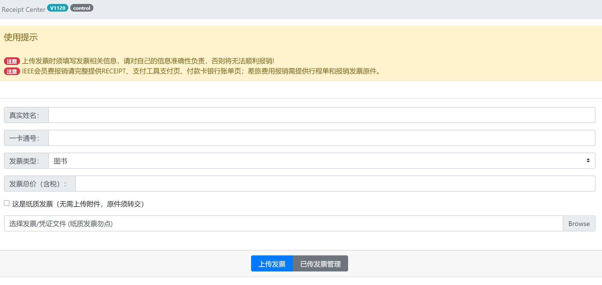

# Receipt_Center
A Smart and Robust Receipt Management Solution for Corps and Labs.

## Tech. Stack

Apache + MySQL + PHP

## Functionalities

1. Support individual receipts management (including uploading, revoking, and viewing)
2. Support five different kinds of receipts (i.e., books, materials, office supplies, IEEE membership, and travel)
3. Support advanced administration and summarization of selected types of receipts

## Installation

1. Deploy Apache, MySQL, PHP on your own Linux-based server
2. Determine your html directory (e.g., /var/www/html/) and copy all files in this repo to that location
3. Run `initialize.sql` in your MySQL environment to initialize the basic database and tables
4. Remotely Visit `receipt_center.html` on your server

To further prepare the platform for production and enable advanced management of receipts (by clicking the `control` button in the banner area), some codes must be modified. 

1. `php/connection.php` Line4/5/6: replace the current variables according to your MySQL settings. This is critical for all the operations on this platform.
2. `php/mgrfilesearch.php` Line7: replace the current control key with your own SHA256-encrypted code.
3. `php/mgrfiletag.php` Line7:  replace the current control key with your own SHA256-encrypted code. The above two mgr-prefixed files are for the control-Advance Mgr. function.
4. `php/config.php` Line23 and `php/filemgr.php` Line28: replace the current KV with your own account (the passwords should be SHA256-encrypted). This is for the control-Files function.

## Version

Development: 20201124